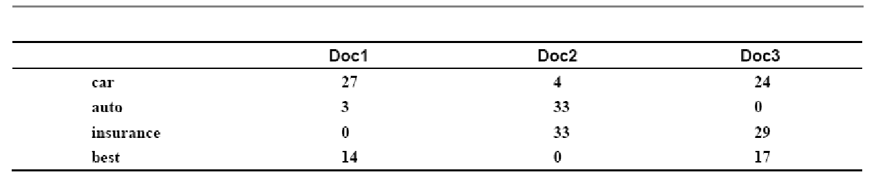
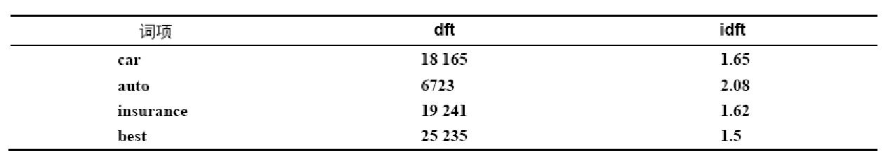

# 习题 3
## 1
考虑图1 中的 3 篇文档 Doc1、Doc2、Doc3 中几个词项的 tf 情况, 采用图2 中的 idf 值来计算所有词项 car、auto、insurance 及 best 的 tf-idf 值.

图1 tf

图2 idf

---

$\text{tf-idf} = \text{tf} \cdot \text{idf} = \text{tf}_{\text{图1}} * \text{idft}_{\text{图2}}$

| t         | Doc1  | Doc2  | Doc3  |
| --------- | ----- | ----- | ----- |
| car       | 44.55 | 6.6   | 39.6  |
| auto      | 6.24  | 68.64 | 0     |
| insurance | 0     | 53.46 | 46.98 |
| best      | 21    | 0     | 25.5  |
