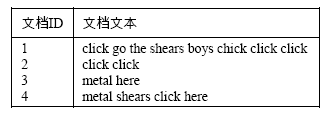
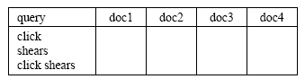

# 习题5
1、假定某文档集由如下 4 篇文档组成:

为该文档集建立一个查询似然模型. 假定采用文档语言模型和文档集语言模型的混合模型, 权重均为 0.5. 采用 MLE 来估计两个一元模型. 计算在查询 click、shears 以及 click shears 下每篇文档模型对应的概率, 并利用这些概率来对返回的文档排序. 将这些概率填在下表中.

$$
\begin{align*}
    p_{ML}(w_i|M_D) & = \frac{c(w_i,D)}{|D|} \\
    p(w|C) & = \frac{\sum_{D}{c(w,D)}}{\sum_{w}{\sum_{D}{c(w,D)}}} \\
    p(w|D) & = \lambda p_{ML}(w|D) + (1 - \lambda) p(w|C) \\
    & = \frac{1}{2} p_{ML}(w|D) + \frac{1}{2} p(w|C) \quad  (\lambda = \frac{1}{2}) \\
    & = \frac{c(w_i,D)}{2 |D|} + \frac{\sum_{D}{c(w,D)}}{2 \sum_{w}{\sum_{D}{c(w,D)}}} \\
    p(w_1 w_2|D) & = p(w_1|D) p(w_2|D) \\
\end{align*}
$$

| query        | doc1                                                         | doc2                                                           | doc3                                                          | doc4                                                          |
| ------------ | ------------------------------------------------------------ | -------------------------------------------------------------- | ------------------------------------------------------------- | ------------------------------------------------------------- |
| click        | $\frac{3}{2 \times 8} + \frac{6}{2 \times 16} = \frac{3}{8}$ | $\frac{2}{2 \times 2} + \frac{6}{2 \times 16} = \frac{11}{16}$ | $\frac{0}{2 \times 2} + \frac{6}{2 \times 16} = \frac{3}{16}$ | $\frac{1}{2 \times 4} + \frac{6}{2 \times 16} = \frac{5}{16}$ |
| shears       | $\frac{1}{2 \times 8} + \frac{2}{2 \times 16} = \frac{1}{8}$ | $\frac{0}{2 \times 2} + \frac{2}{2 \times 16} = \frac{1}{16}$  | $\frac{0}{2 \times 2} + \frac{2}{2 \times 16} = \frac{1}{16}$ | $\frac{1}{2 \times 4} + \frac{2}{2 \times 16} = \frac{3}{16}$ |
| click shears | $\frac{3}{8} \times \frac{1}{8} = \frac{3}{64}$              | $\frac{11}{16} \times \frac{1}{16} = \frac{11}{256}$           | $\frac{3}{16} \times \frac{1}{16} = \frac{3}{256}$            | $\frac{5}{16} \times \frac{3}{16} = \frac{15}{256}$           |

对于查询 click shears 来说, 最后得到的文档次序如何?
doc1 > doc4 > doc2 > doc3
